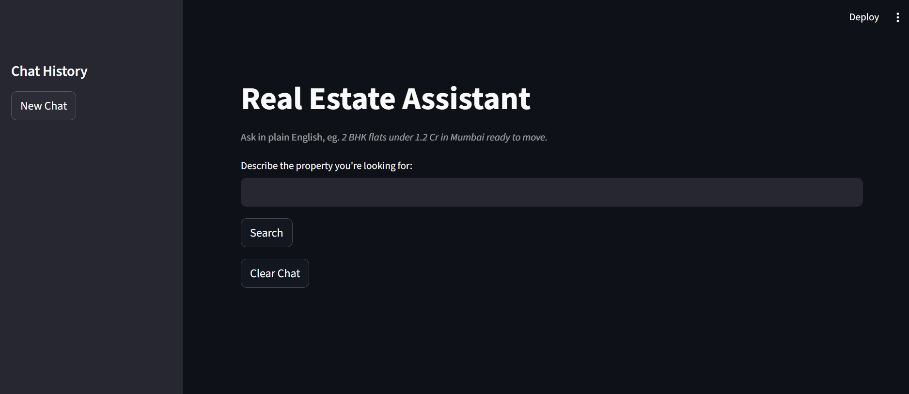
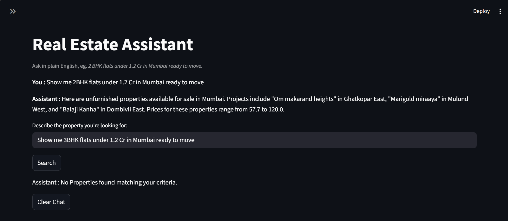
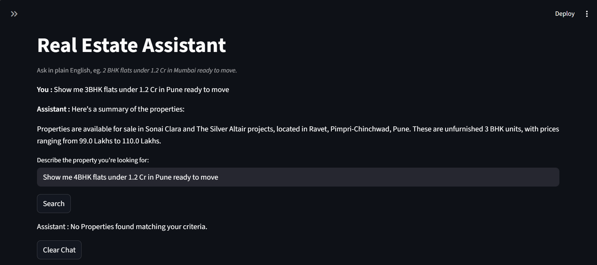

# Real-Estate-Assistant

A streamlit based Real Estate Assistant that allows users to search, filter, and summarize property listings using **Google Gemini API** and **Langchain**.
The app accepts plain English queries like '2 BHK flats under 1.2 Cr in Mumbai ready to move' and returns a concise human-readable summary of matching properties.

# Features 

- Search properties by **City , Landmark , BHK , Budget and Status**.
- Generate **Human-Readable Summaries** of filtered datasets using Google Gemini LLM [gemini-2.5-flash]
- **Sidebar Chat History** to keep track of previous queries.
- **New Chat** button to start fresh conversation.
- **Clear Chat** button for clearing existing chat with assistant. 

# Demo

**This is the page the user will see when they run the app.** The user should write the query in input box like '2 BHK flats under 1.2 Cr in Mumbai ready to move' and hit the **Search** button.

The generated summary from the LLM will be shown below the input box. The generated summary will be in 3-4 sentences. The previous chats of the user and assistant are shown above the input box. The **Clear Chat** button will clear all the previous chats with the assistant.

The assistant will print '**No Properties found matching your criteria.**' if no data is found in the dataset satisfing the conditions.

In sidebar **New Chat** button allows to create a new chat with assistant and saves the current chat with the user. You can also continue your previous chats with the assistant by clicking on the chat button.
